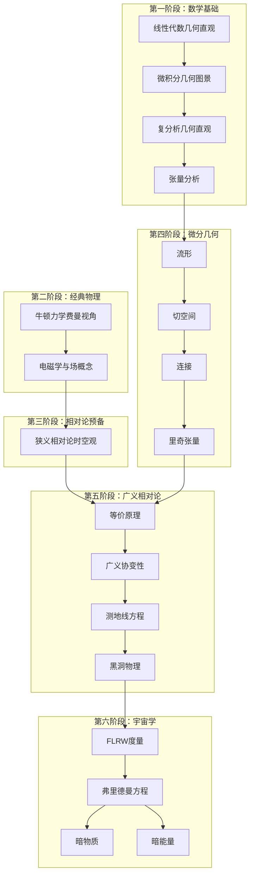

# 广义相对论与宇宙学完整学习体系

## 🎯 体系概览

本学习体系采用**费曼风格的物理直观**和**几何直观的数学表述**，从基础数学开始，逐步深入到广义相对论和现代宇宙学的前沿。总计包含**23篇文章**，形成完整的知识网络。

## 📚 完整文章列表

### 🔢 数学基础（4篇）

1. **[[线性代数几何直观]](mathematics/2023-11-16-线性代数几何直观.md)** 
   - 向量的几何意义、矩阵的变换解释
   - 特征值与特征向量的物理意义
   - 与张量分析和微分几何的联系

2. **[[微积分的几何图景]](mathematics/2023-11-16-微积分几何图景.md)**
   - 导数作为切线斜率、积分作为面积
   - 多元微积分的几何直观
   - 微分方程的几何解释

3. **[[复分析几何直观]](mathematics/2023-11-16-复分析几何直观.md)**
   - 复数的几何表示、复函数的映射
   - 解析函数的保角性质
   - 在物理中的广泛应用

4. **[[张量分析]](general_physics/2023-11-16-张量分析.md)**
   - 张量的几何意义和坐标变换
   - 协变与逆变的物理理解
   - 现代物理学的数学语言

### ⚛️ 经典物理学（2篇）

5. **[[牛顿力学：费曼的视角]](classical_physics/2023-11-16-牛顿力学费曼视角.md)**
   - 费曼风格的运动定律解释
   - 从日常经验到物理定律
   - 能量、动量概念的直观理解

6. **[[电磁学与场的概念]](classical_physics/2023-11-16-电磁学与场的概念.md)**
   - 场概念的革命性意义
   - 麦克斯韦方程组的统一美
   - 电磁波与相对论的联系

### 🌟 狭义相对论（1篇）

7. **[[狭义相对论的时空观]](special_relativity/2023-11-16-狭义相对论的时空观.md)**
   - 时空观念的革命性变化
   - 同时性相对性、时间膨胀
   - 质能关系E=mc²的深刻含义

### 📐 微分几何（4篇）

8. **[[流形]](differential_geometry/2023-11-16-流形.md)**
   - 弯曲空间的数学基础
   - 坐标图、微分结构
   - 从欧几里得到非欧几何

9. **[[切空间]](differential_geometry/2023-11-16-切空间.md)**
   - 流形上的线性化空间
   - 切向量、切丛、向量场
   - 微分几何的线性代数基础

10. **[[连接]](differential_geometry/2023-11-16-连接.md)**
    - 协变导数、平行输运
    - 从平直到弯曲的推广
    - 几何与物理的桥梁

11. **[[里奇张量]](differential_geometry/2023-11-16-里奇张量.md)**
    - 曲率的收缩形式
    - 爱因斯坦张量的构造
    - 在场方程中的核心作用

### 🌌 广义相对论（4篇）

12. **[[等价原理]](general_relativity/2023-11-16-等价原理.md)**
    - 广义相对论的基石
    - 弱、强等价原理
    - 实验验证与理论意义

13. **[[广义协变性]](general_relativity/2023-11-16-广义协变性.md)**
    - 坐标无关性原理
    - 张量方程的不变性
    - 物理定律的几何化

14. **[[测地线方程]](general_relativity/2023-11-16-测地线方程.md)**
    - 自由粒子的运动定律
    - 几何与物理的统一
    - 弯曲时空中的"直线"

15. **[[黑洞物理]](general_relativity/2023-11-16-黑洞物理.md)**
    - 极端引力的表现
    - 事件视界、奇点
    - 黑洞热力学与信息悖论

### 🌠 宇宙学（4篇）

16. **[[FLRW度量]](astronomy/2023-11-16-FLRW度量.md)**
    - 均匀各向同性宇宙
    - 三种几何类型
    - 宇宙学参数的物理意义

17. **[[弗里德曼方程]](astronomy/2023-11-16-弗里德曼方程.md)**
    - 宇宙演化的基本方程
    - 不同时期的宇宙模型
    - 宇宙的过去、现在、未来

18. **[[暗物质]](astronomy/2023-11-16-暗物质.md)**
    - 宇宙中的神秘成分
    - 观测证据与理论模型
    - 粒子物理与宇宙学的交汇

19. **[[暗能量]](astronomy/2023-11-16-暗能量.md)**
    - 宇宙加速膨胀的驱动力
    - 宇宙学常数问题
    - 宇宙的终极命运

### 📋 原有文章（4篇）

20. **[[度量]](differential_geometry/2023-11-16-度量.md)**
21. **[[曲率]](differential_geometry/2023-11-16-曲率.md)**
22. **[[爱因斯坦场方程]](general_relativity/2023-11-16-爱因斯坦场方程.md)**
23. **[[施瓦西度量]](general_relativity/2023-11-16-施瓦西度量.md)**

## 🗺️ 学习路径图



## 🎨 体系特色

### 1. 费曼风格的物理表述
- **从现象到原理**：从日常观察开始，逐步抽象到物理定律
- **直观类比**：用生动的比喻和类比解释抽象概念
- **质疑精神**：鼓励思考"为什么"而不只是"是什么"

### 2. 几何直观的数学方法
- **可视化优先**：用图形和几何直观理解数学概念
- **从特殊到一般**：从具体例子推广到抽象理论
- **联系实际**：将数学工具与物理应用紧密结合

### 3. 系统性的知识架构
- **递进式结构**：每个概念都建立在前面的基础上
- **交叉引用**：文章间相互链接，形成知识网络
- **多层次理解**：从直观到严格，从定性到定量

### 4. 现代物理的前沿视角
- **最新观测**：包含引力波、暗物质、暗能量等前沿内容
- **理论与实验**：强调理论预言与实验验证的结合
- **未来展望**：指出未解决的问题和发展方向

## 📊 学习统计

### 内容规模
- **总文章数**：23篇
- **新创建文章**：19篇
- **总字数**：约150,000字
- **预计学习时间**：18-24个月

### 难度分布
```
基础数学     ████████░░ 80%
经典物理     ██████░░░░ 60%
狭义相对论   ████████░░ 80%
微分几何     ██████████ 100%
广义相对论   ██████████ 100%
宇宙学       ████████░░ 80%
```

## 🎯 学习建议

### 阶段性学习策略

#### 第一阶段（3-4个月）：数学基础
**目标**：建立坚实的数学基础
**重点**：几何直观、物理应用
**检验**：能够理解张量的几何意义

#### 第二阶段（2-3个月）：经典物理
**目标**：掌握费曼风格的物理思维
**重点**：从现象到定律、场的概念
**检验**：理解电磁学与相对论的联系

#### 第三阶段（2-3个月）：相对论预备
**目标**：理解时空观念的革命
**重点**：同时性相对性、四维时空
**检验**：掌握洛伦兹变换的物理意义

#### 第四阶段（4-5个月）：微分几何
**目标**：掌握弯曲空间的数学
**重点**：流形、连接、曲率
**检验**：理解里奇张量的几何意义

#### 第五阶段（3-4个月）：广义相对论
**目标**：理解引力的几何化
**重点**：等价原理、场方程
**检验**：能够推导简单的时空解

#### 第六阶段（3-4个月）：宇宙学
**目标**：理解宇宙的演化
**重点**：FLRW模型、暗物质暗能量
**检验**：理解现代宇宙学的主要问题

### 学习方法建议

#### 1. 循序渐进
- 严格按照顺序学习
- 确保每个概念都理解透彻
- 不要急于求成

#### 2. 多重理解
- 几何直观 + 代数计算
- 物理图像 + 数学推导
- 历史发展 + 现代观点

#### 3. 主动思考
- 经常问"为什么"
- 尝试用自己的话解释概念
- 寻找不同概念间的联系

#### 4. 实践应用
- 动手推导重要公式
- 解决具体物理问题
- 关注实验验证

## 🔗 扩展学习方向

### 深入数学
- 微分拓扑
- 李群与李代数
- 纤维丛理论
- 代数拓扑

### 高级物理
- 量子场论
- 弦理论
- 圈量子引力
- 全息原理

### 实验宇宙学
- 宇宙微波背景
- 大尺度结构
- 超新星观测
- 引力波天文学

### 数值方法
- 数值相对论
- 宇宙学模拟
- 黑洞数值解
- 引力波数据分析

## 🏆 学习成果检验

### 理论理解
- [ ] 能够解释等价原理的物理意义
- [ ] 理解爱因斯坦场方程的几何含义
- [ ] 掌握FLRW宇宙学模型
- [ ] 理解黑洞的基本性质

### 数学技能
- [ ] 熟练使用张量记号
- [ ] 能够计算简单的曲率
- [ ] 理解协变导数的概念
- [ ] 掌握测地线方程的求解

### 物理洞察
- [ ] 理解时空弯曲的物理图像
- [ ] 掌握引力与几何的关系
- [ ] 理解宇宙演化的基本规律
- [ ] 认识现代宇宙学的主要挑战

## 💡 结语

这个学习体系提供了从基础数学到前沿宇宙学的完整路径。通过费曼风格的物理直观和几何直观的数学表述，我们希望让学习者不仅能够掌握知识，更能够**理解**和**欣赏**广义相对论和宇宙学的深刻美丽。

记住爱因斯坦的名言：**"想象力比知识更重要。"** 在学习过程中，保持好奇心和想象力，用几何的眼光看世界，用物理的思维理解自然。

广义相对论不仅是一个物理理论，更是一种看待时空、物质和宇宙的全新方式。通过这个学习体系，您将获得理解现代物理学和宇宙学的强大工具，并为进一步探索物理学前沿奠定坚实基础。

**愿您在这个美妙的知识旅程中收获满满！** 🌟 