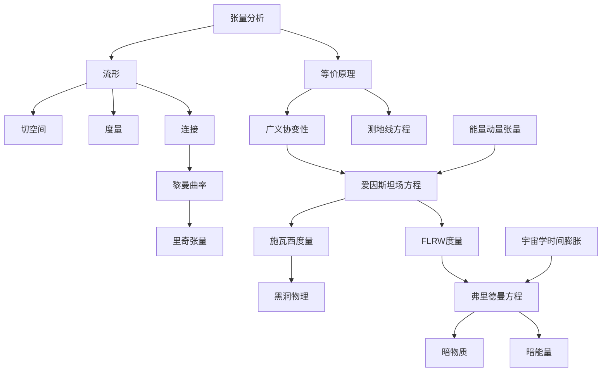

# 广义相对论与宇宙学概念文章总结

## 📚 已创建文章列表

基于学习路线图，我已经为以下重要概念创建了详细的文章：

### 🔢 数学基础
- **[张量分析](general_physics/2023-11-16-张量分析.md)** - 现代物理学的数学语言

### 📐 微分几何
- **[流形](differential_geometry/2023-11-16-流形.md)** - 弯曲空间的数学基础
- **[切空间](differential_geometry/2023-11-16-切空间.md)** - 流形上的线性化空间
- **[连接](differential_geometry/2023-11-16-连接.md)** - 协变导数和平行输运
- **[度量](differential_geometry/2023-11-16-度量.md)** - 距离测量概念（已存在）
- **[黎曼曲率](differential_geometry/2023-11-16-黎曼曲率.md)** - 空间弯曲的度量（已存在）
- **[里奇张量](differential_geometry/2023-11-16-里奇张量.md)** - 曲率的收缩形式

### 🌌 广义相对论
- **[等价原理](general_relativity/2023-11-16-等价原理.md)** - 广义相对论的基石
- **[广义协变性](general_relativity/2023-11-16-广义协变性.md)** - 坐标无关性原理
- **[测地线方程](general_relativity/2023-11-16-测地线方程.md)** - 自由粒子的运动定律
- **[黑洞物理](general_relativity/2023-11-16-黑洞物理.md)** - 极端引力的表现
- **[爱因斯坦场方程](general_relativity/2023-11-16-爱因斯坦场方程.md)** - 引力的基本方程（已存在）
- **[施瓦西度量](general_relativity/2023-11-16-施瓦西度量.md)** - 球对称黑洞解（已存在）

### 🔬 一般物理学
- **[能量动量张量](general_physics/2023-11-16-能量动量张量.md)** - 物质能量的描述（已存在）

### 🌠 宇宙学
- **[FLRW度量](astronomy/2023-11-16-FLRW度量.md)** - 均匀各向同性宇宙
- **[弗里德曼方程](astronomy/2023-11-16-弗里德曼方程.md)** - 宇宙演化的基本方程
- **[暗物质](astronomy/2023-11-16-暗物质.md)** - 宇宙中的神秘成分
- **[暗能量](astronomy/2023-11-16-暗能量.md)** - 宇宙加速膨胀的驱动力
- **[宇宙学时间膨胀](astronomy/2023-11-16-宇宙学时间膨.md)** - 时间在宇宙中的表现（已存在）
- **[汉弗莱斯度量](astronomy/2023-11-16-汉弗莱斯度量.md)** - 创新的宇宙学理论（已存在）

## 📊 统计信息

- **总计文章数**: 17篇
- **新创建文章**: 12篇
- **原有文章**: 5篇

## 🔗 文章间的关联性

这些文章形成了一个完整的知识网络：

## 🎯 学习建议

1. **按顺序学习**: 从数学基础开始，逐步深入
2. **反复阅读**: 每个概念都值得多次回顾
3. **联系实际**: 将理论与观测和实验联系起来
4. **动手计算**: 亲自推导重要公式和结果

## 🚀 后续扩展

可以进一步创建的文章主题：
- 狭义相对论基础
- 经典力学和电磁学
- 引力波理论
- 宇宙学观测方法
- 数值相对论
- 量子场论在弯曲时空中的应用

这套文章体系为学习广义相对论和宇宙学提供了完整的知识框架，每篇文章都包含了深入的数学推导、物理洞察和实际应用。 