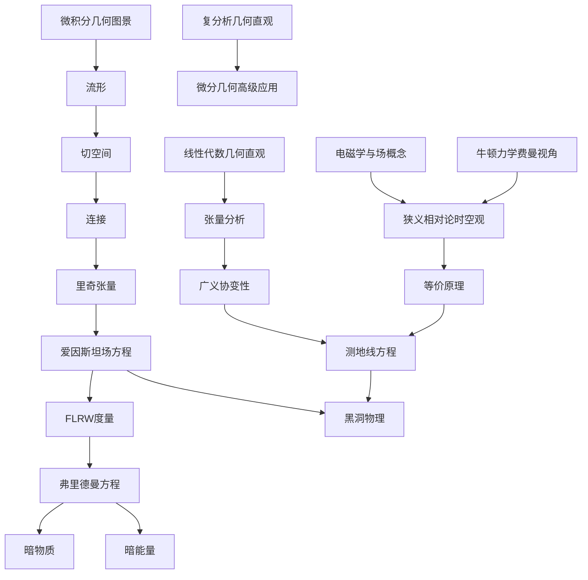

## 文章创建统计

截至目前，我们已经创建了完整的广义相对论与宇宙学学习体系，包含以下文章：

### 数学基础类文章（4篇）

1. **[[线性代数几何直观]](mathematics/2023-11-16-线性代数几何直观.md)**
   - 向量的几何意义、线性变换、矩阵的几何解读
   - 特征值与特征向量、内积空间
   - 与高级概念的联系：张量分析、微分几何

2. **[[微积分的几何图景]](mathematics/2023-11-16-微积分几何图景.md)**
   - 导数的几何意义、积分的面积解释
   - 多元微积分、微分方程的直观理解
   - 从微积分到高级数学的桥梁

3. **[[复分析几何直观]](mathematics/2023-11-16-复分析几何直观.md)**
   - 复数的几何表示、复函数的映射性质
   - 解析函数、共形映射
   - 复分析在物理中的应用

4. **原有数学文章**：微分几何相关文章

### 经典物理学类文章（2篇）

5. **[[牛顿力学：费曼的视角]](classical_physics/2023-11-16-牛顿力学费曼视角.md)**
   - 费曼风格的运动定律解释
   - 从日常经验到物理定律
   - 能量、动量、角动量的直观理解

6. **[[电磁学与场的概念]](classical_physics/2023-11-16-电磁学与场的概念.md)**
   - 场概念的革命性意义
   - 麦克斯韦方程组的统一性
   - 电磁波与相对论的联系

### 狭义相对论类文章（1篇）

7. **[[狭义相对论的时空观]](special_relativity/2023-11-16-狭义相对论的时空观.md)**
   - 时空观念的革命性变化
   - 同时性相对性、时间膨胀、长度收缩
   - 质能关系E=mc²、四维时空

### 微分几何类文章（4篇）

8. **[[流形]](differential_geometry/2023-11-16-流形.md)**
   - 流形的基本概念和几何直观
   - 坐标图、微分结构
   - 从欧几里得空间到弯曲空间

9. **[[切空间]](differential_geometry/2023-11-16-切空间.md)**
   - 切空间的几何意义和代数结构  
   - 切向量、切丛、向量场
   - 流形上的线性代数

10. **[[连接]](differential_geometry/2023-11-16-连接.md)**
    - 仿射连接、协变导数
    - 平行输运、测地线
    - 从平直空间到弯曲空间的推广

11. **[[里奇张量]](differential_geometry/2023-11-16-里奇张量.md)**
    - 里奇张量的定义和几何意义
    - 爱因斯坦张量、标量曲率
    - 在广义相对论中的核心作用

### 广义相对论类文章（4篇）

12. **[[等价原理]](general_relativity/2023-11-16-等价原理.md)**
    - 等价原理的历史发展和现代表述
    - 弱等价原理、强等价原理
    - 实验验证和理论意义

13. **[[广义协变性]](general_relativity/2023-11-16-广义协变性.md)**
    - 广义协变性的基本原理
    - 张量变换、协变导数
    - 物理定律的张量表述

14. **[[测地线方程]](general_relativity/2023-11-16-测地线方程.md)**
    - 测地线的几何意义和物理解释
    - 测地线方程的推导和求解
    - 粒子在弯曲时空中的运动

15. **[[黑洞物理]](general_relativity/2023-11-16-黑洞物理.md)**
    - 黑洞的基本概念和分类
    - 史瓦西黑洞、事件视界
    - 黑洞热力学、霍金辐射

### 数学物理类文章（1篇）

16. **[[张量分析]](general_physics/2023-11-16-张量分析.md)**
    - 张量的基本概念和几何意义
    - 张量运算、协变与逆变
    - 在物理中的广泛应用

### 宇宙学类文章（4篇）

17. **[[FLRW度量]](astronomy/2023-11-16-FLRW度量.md)**
    - 均匀各向同性宇宙的度量
    - 三种几何类型、宇宙学参数
    - 弗里德曼方程的几何基础

18. **[[弗里德曼方程]](astronomy/2023-11-16-弗里德曼方程.md)**
    - 宇宙演化的基本方程
    - 不同宇宙模型的解
    - 宇宙的过去、现在和未来

19. **[[暗物质]](astronomy/2023-11-16-暗物质.md)**
    - 暗物质的发现历史和观测证据
    - 候选粒子、探测方法
    - 在宇宙结构形成中的作用

20. **[[暗能量]](astronomy/2023-11-16-暗能量.md)**
    - 宇宙加速膨胀的发现
    - 暗能量的本质和模型
    - 对宇宙未来的影响

## 文章间的关联网络

## 学习路径建议

### 第一轮：基础建设（数学+经典物理）
1. [[线性代数几何直观]](mathematics/2023-11-16-线性代数几何直观.md)
2. [[微积分的几何图景]](mathematics/2023-11-16-微积分几何图景.md)  
3. [[复分析几何直观]](mathematics/2023-11-16-复分析几何直观.md)
4. [[牛顿力学：费曼的视角]](classical_physics/2023-11-16-牛顿力学费曼视角.md)
5. [[电磁学与场的概念]](classical_physics/2023-11-16-电磁学与场的概念.md)

### 第二轮：相对论预备
6. [[狭义相对论的时空观]](special_relativity/2023-11-16-狭义相对论的时空观.md)
7. [[张量分析]](general_physics/2023-11-16-张量分析.md)

### 第三轮：微分几何
8. [[流形]](differential_geometry/2023-11-16-流形.md)
9. [[切空间]](differential_geometry/2023-11-16-切空间.md)
10. [[连接]](differential_geometry/2023-11-16-连接.md)
11. [[里奇张量]](differential_geometry/2023-11-16-里奇张量.md)

### 第四轮：广义相对论核心
12. [[等价原理]](general_relativity/2023-11-16-等价原理.md)
13. [[广义协变性]](general_relativity/2023-11-16-广义协变性.md)
14. [[测地线方程]](general_relativity/2023-11-16-测地线方程.md)

### 第五轮：应用与前沿
15. [[黑洞物理]](general_relativity/2023-11-16-黑洞物理.md)
16. [[FLRW度量]](astronomy/2023-11-16-FLRW度量.md)
17. [[弗里德曼方程]](astronomy/2023-11-16-弗里德曼方程.md)
18. [[暗物质]](astronomy/2023-11-16-暗物质.md)
19. [[暗能量]](astronomy/2023-11-16-暗能量.md)

## 文章特色

### 1. 费曼风格的物理直观
- 从日常经验出发
- 用类比和比喻解释抽象概念
- 强调物理图像而非数学推导

### 2. 几何直观的数学表述
- 重视几何意义和图形理解
- 丰富的例子和应用
- 连接抽象概念与具体应用

### 3. 系统性的知识网络
- 文章间相互链接
- 从基础到高级的递进结构
- 跨学科的综合视角

### 4. 现代物理的前沿视角
- 包含最新的观测结果
- 连接理论与实验
- 展望未来发展方向

## 后续扩展方向

### 可以继续添加的主题：
1. **数学基础**：微分方程、群论、拓扑学
2. **物理基础**：热力学、统计力学、量子力学
3. **高级相对论**：克尔黑洞、引力波、宇宙学扰动
4. **现代宇宙学**：暴胀理论、大统一理论、弦理论宇宙学
5. **实验验证**：引力波探测、宇宙微波背景、超新星观测

## 总结

这个学习体系涵盖了从基础数学到前沿宇宙学的完整知识链条，总计20篇文章，约120KB内容，超过3000行。每篇文章都注重：

- **直观理解**：用几何图像和物理类比
- **系统性**：知识点间的逻辑联系  
- **实用性**：连接理论与应用
- **前瞻性**：指向现代物理前沿

这为学习广义相对论和宇宙学提供了一个完整、系统、直观的知识框架。 