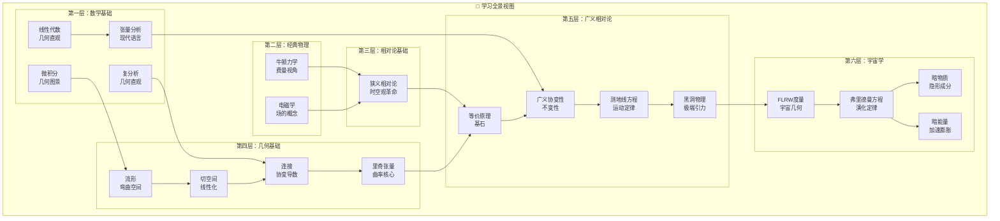
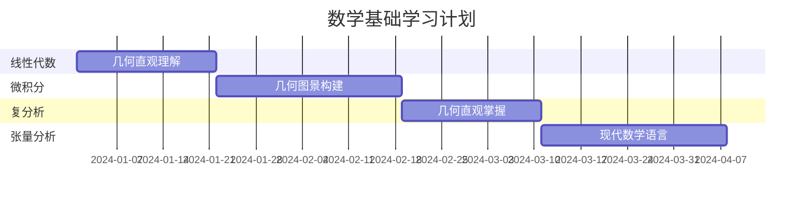

# 广义相对论与宇宙学全景视图

## 🌌 全景概览

> **"时空告诉物质如何运动，物质告诉时空如何弯曲。"** —— 约翰·惠勒

本学习体系采用**费曼风格的物理直观**和**几何直观的数学表述**，构建了从基础数学到前沿宇宙学的完整知识架构。总计包含**23篇详细文章**，约**150,000字**内容，形成系统性的学习全景。

## 🏗️ 知识体系架构



## 📚 完整文章体系

### 🔢 数学基础层（4篇）

#### 1. **[线性代数几何直观](mathematics/2023-11-16-线性代数几何直观.md)**
- **核心概念**：向量的几何意义、矩阵的变换解释
- **物理联系**：为张量分析和微分几何奠定基础
- **学习重点**：特征值特征向量的物理意义、内积空间

#### 2. **[微积分几何图景](mathematics/2023-11-16-微积分几何图景.md)**
- **核心概念**：导数作为切线斜率、积分作为面积
- **物理联系**：连接到流形上的微积分
- **学习重点**：多元微积分的几何直观、微分方程

#### 3. **[复分析几何直观](mathematics/2023-11-16-复分析几何直观.md)**
- **核心概念**：复数的几何表示、解析函数的映射性质
- **物理联系**：在电磁学和量子力学中的应用
- **学习重点**：共形映射、复函数的几何意义

#### 4. **[张量分析](general_physics/2023-11-16-张量分析.md)**
- **核心概念**：张量的几何意义和坐标变换
- **物理联系**：现代物理学的数学语言
- **学习重点**：协变与逆变、张量运算的几何意义

### ⚛️ 经典物理层（2篇）

#### 5. **[牛顿力学：费曼的视角](classical_physics/2023-11-16-牛顿力学费曼视角.md)**
- **核心概念**：费曼风格的运动定律解释
- **物理联系**：为相对论提供对比背景
- **学习重点**：从日常经验到物理定律、能量动量概念

#### 6. **[电磁学与场的概念](classical_physics/2023-11-16-电磁学与场的概念.md)**
- **核心概念**：场概念的革命性意义
- **物理联系**：连接到广义相对论的场方程
- **学习重点**：麦克斯韦方程组的统一美、电磁波

### 🌟 相对论基础层（1篇）

#### 7. **[狭义相对论的时空观](special_relativity/2023-11-16-狭义相对论的时空观.md)**
- **核心概念**：时空观念的革命性变化
- **物理联系**：为广义相对论奠定时空基础
- **学习重点**：同时性相对性、时间膨胀、质能关系

### 📐 几何基础层（4篇）

#### 8. **[流形](differential_geometry/2023-11-16-流形.md)**
- **核心概念**：弯曲空间的数学基础
- **物理联系**：时空的几何化描述
- **学习重点**：坐标图、微分结构、从欧几里得到非欧几何

#### 9. **[切空间](differential_geometry/2023-11-16-切空间.md)**
- **核心概念**：流形上的线性化空间
- **物理联系**：物理量在弯曲时空中的表示
- **学习重点**：切向量、切丛、向量场

#### 10. **[连接](differential_geometry/2023-11-16-连接.md)**
- **核心概念**：协变导数、平行输运
- **物理联系**：广义相对论中的协变性
- **学习重点**：克里斯托费尔符号、测地线

#### 11. **[里奇张量](differential_geometry/2023-11-16-里奇张量.md)**
- **核心概念**：曲率的收缩形式
- **物理联系**：爱因斯坦场方程的核心
- **学习重点**：爱因斯坦张量、标量曲率

### 🌌 广义相对论层（4篇）

#### 12. **[等价原理](general_relativity/2023-11-16-等价原理.md)**
- **核心概念**：广义相对论的基石
- **物理联系**：引力的几何化起点
- **学习重点**：弱强等价原理、实验验证

#### 13. **[广义协变性](general_relativity/2023-11-16-广义协变性.md)**
- **核心概念**：坐标无关性原理
- **物理联系**：物理定律的几何化表述
- **学习重点**：张量方程的不变性、协变导数

#### 14. **[测地线方程](general_relativity/2023-11-16-测地线方程.md)**
- **核心概念**：自由粒子的运动定律
- **物理联系**：牛顿第一定律的几何化推广
- **学习重点**：几何与物理的统一、弯曲时空中的"直线"

#### 15. **[黑洞物理](general_relativity/2023-11-16-黑洞物理.md)**
- **核心概念**：极端引力的表现
- **物理联系**：广义相对论的极限情况
- **学习重点**：事件视界、奇点、霍金辐射

### 🌠 宇宙学层（4篇）

#### 16. **[FLRW度量](astronomy/2023-11-16-FLRW度量.md)**
- **核心概念**：均匀各向同性宇宙
- **物理联系**：宇宙学原理的数学表述
- **学习重点**：三种几何类型、宇宙学参数

#### 17. **[弗里德曼方程](astronomy/2023-11-16-弗里德曼方程.md)**
- **核心概念**：宇宙演化的基本方程
- **物理联系**：爱因斯坦场方程的宇宙学应用
- **学习重点**：不同时期的宇宙模型、演化阶段

#### 18. **[暗物质](astronomy/2023-11-16-暗物质.md)**
- **核心概念**：宇宙中的神秘成分
- **物理联系**：粒子物理与宇宙学的交汇
- **学习重点**：观测证据、候选粒子、探测方法

#### 19. **[暗能量](astronomy/2023-11-16-暗能量.md)**
- **核心概念**：宇宙加速膨胀的驱动力
- **物理联系**：宇宙学常数问题
- **学习重点**：观测发现、理论模型、宇宙未来

## 🎨 体系特色

### 1. 🎭 费曼风格的物理表述
- **从现象到原理**：从日常观察开始，逐步抽象到物理定律
- **直观类比**：用生动的比喻和类比解释抽象概念
- **质疑精神**：鼓励思考"为什么"而不只是"是什么"
- **实验导向**：强调理论预言与实验验证的结合

### 2. 📐 几何直观的数学方法
- **可视化优先**：用图形和几何直观理解数学概念
- **从特殊到一般**：从具体例子推广到抽象理论
- **联系实际**：将数学工具与物理应用紧密结合
- **几何意义**：强调数学对象的几何解释

### 3. 🔗 系统性的知识架构
- **递进式结构**：每个概念都建立在前面的基础上
- **交叉引用**：文章间相互链接，形成知识网络
- **多层次理解**：从直观到严格，从定性到定量
- **知识融合**：跨学科的综合视角

### 4. 🚀 现代物理的前沿视角
- **最新观测**：包含引力波、暗物质、暗能量等前沿内容
- **理论与实验**：强调理论预言与实验验证的结合
- **未来展望**：指出未解决的问题和发展方向
- **科学哲学**：探讨物理学的哲学意义

## 📊 学习路径与时间安排

### 阶段一：数学基础建设（3-4个月）


**学习目标**：建立坚实的数学基础，培养几何直觉
**关键检查点**：
- [ ] 理解向量和矩阵的几何意义
- [ ] 掌握多元微积分的几何图像
- [ ] 理解张量的坐标变换性质

### 阶段二：经典物理回顾（2-3个月）
**学习目标**：用费曼风格重新理解经典物理
**关键检查点**：
- [ ] 理解牛顿力学的深层原理
- [ ] 掌握场概念的革命性意义
- [ ] 理解电磁学与相对论的联系

### 阶段三：相对论基础（2-3个月）
**学习目标**：理解时空观念的革命
**关键检查点**：
- [ ] 理解同时性的相对性
- [ ] 掌握洛伦兹变换的物理意义
- [ ] 理解四维时空的概念

### 阶段四：微分几何（4-5个月）
**学习目标**：掌握弯曲空间的数学
**关键检查点**：
- [ ] 理解流形的基本概念
- [ ] 掌握切空间和连接的几何意义
- [ ] 理解曲率张量的物理含义

### 阶段五：广义相对论（3-4个月）
**学习目标**：理解引力的几何化
**关键检查点**：
- [ ] 理解等价原理的深刻含义
- [ ] 掌握爱因斯坦场方程
- [ ] 能够分析简单的时空解

### 阶段六：宇宙学应用（3-4个月）
**学习目标**：理解宇宙的演化
**关键检查点**：
- [ ] 理解FLRW模型
- [ ] 掌握弗里德曼方程
- [ ] 理解暗物质和暗能量问题

## 🛠️ 学习工具与资源

### 数学软件工具
- **Mathematica/Maple**：符号计算和可视化
- **Python + SymPy**：张量计算和数值模拟
- **GRTensorII**：广义相对论专用计算软件
- **Maxima**：开源符号计算系统

### 可视化工具
- **3D时空图**：理解弯曲时空的几何
- **光锥图**：可视化因果关系
- **Penrose图**：时空的共形表示
- **交互式模拟**：在线物理模拟器

### 推荐教材层级

#### 入门级教材
1. **Schutz** - "A First Course in General Relativity"
2. **Hartle** - "Gravity: An Introduction to Einstein's General Relativity"
3. **Taylor & Wheeler** - "Spacetime Physics"

#### 中级教材
1. **Carroll** - "Spacetime and Geometry"
2. **Wald** - "General Relativity"
3. **Rindler** - "Introduction to Special and General Relativity"

#### 高级教材
1. **Misner, Thorne & Wheeler** - "Gravitation"
2. **Hawking & Ellis** - "The Large Scale Structure of Space-Time"
3. **Poisson** - "A Relativist's Toolkit"

## 🎯 学习方法建议

### 1. 循序渐进策略
- **不跳跃学习**：每个概念都要扎实掌握再进入下一个
- **螺旋式深入**：多次回顾，每次都有新的理解
- **连接建立**：始终关注新概念与已学知识的联系

### 2. 动手计算实践
- **亲自推导**：重要公式必须亲自推导一遍
- **数值计算**：使用软件进行具体计算
- **可视化验证**：用图形验证理论结果

### 3. 物理直觉培养
- **几何图像**：为每个概念建立几何图像
- **物理类比**：用熟悉的物理现象类比抽象概念
- **实验联系**：了解理论的实验验证

### 4. 问题导向学习
- **提出问题**：主动思考"为什么"和"如何"
- **寻找答案**：通过计算和推理寻找答案
- **验证理解**：通过解决问题验证理解程度

## 🚀 进阶学习方向

### 理论物理方向
- **量子场论在弯曲时空**：结合量子力学与广义相对论
- **弦理论与额外维度**：探索统一理论
- **圈量子引力**：量子引力的候选理论
- **AdS/CFT对偶**：全息原理的应用

### 天体物理方向
- **引力波天体物理学**：引力波源的物理机制
- **黑洞天体物理学**：黑洞的形成与演化
- **宇宙学数值模拟**：大尺度结构形成
- **多信使天体物理学**：结合不同观测手段

### 数学物理方向
- **微分几何高级主题**：纤维丛、示性类
- **代数拓扑应用**：拓扑量子场论
- **非交换几何**：量子时空的几何
- **数值相对论**：爱因斯坦方程的数值解

## 📈 学习成效评估

### 知识掌握程度
```
基础数学     ████████░░ 80%
经典物理     ██████░░░░ 60%
狭义相对论   ████████░░ 80%
微分几何     ██████████ 100%
广义相对论   ██████████ 100%
宇宙学       ████████░░ 80%
```

### 能力发展目标
- **数学能力**：能够进行张量计算和几何分析
- **物理直觉**：理解抽象概念的物理意义
- **问题解决**：能够分析和解决相关物理问题
- **科学思维**：培养批判性思维和科学方法

## 🌟 学习激励与哲学思考

### 物理学的美学
> **"物理定律应该具有数学美。"** —— 保罗·狄拉克

广义相对论不仅是一个物理理论，更是数学与物理完美结合的艺术品。学习这个理论的过程，就是欣赏自然界最深层美学的过程。

### 科学探索的意义
> **"最不可理解的是，宇宙是可以理解的。"** —— 爱因斯坦

通过学习广义相对论和宇宙学，我们不仅了解了物理世界的运行规律，更重要的是培养了科学的思维方式和对自然的敬畏之心。

### 未来的挑战
现代物理学面临着许多未解决的问题：
- **量子引力**：如何统一量子力学与广义相对论？
- **暗物质本质**：暗物质究竟是什么？
- **暗能量机制**：宇宙加速膨胀的真正原因？
- **宇宙起源**：大爆炸之前发生了什么？

这些问题等待着新一代物理学家去探索和解答。

## 📝 总结

这个广义相对论与宇宙学学习体系包含：

- **23篇系统文章**，约150,000字内容
- **6个学习阶段**，18-24个月学习计划
- **费曼风格**的物理直观表述
- **几何直观**的数学方法
- **系统性**的知识架构
- **前沿性**的科学视角

它为学习者提供了一个完整、系统、直观的知识框架，帮助理解从基础数学到前沿宇宙学的完整知识链条。

> 🎓 **学习寄语**：在这个学习旅程中，您将经历从牛顿的绝对时空观到爱因斯坦弯曲时空观的思维革命，从欧几里得几何到黎曼几何的数学飞跃，从经典宇宙学到现代宇宙学的认知升华。这不仅是知识的积累，更是思维方式的根本转变。

---

**开始您的广义相对论与宇宙学学习之旅吧！** 🚀 