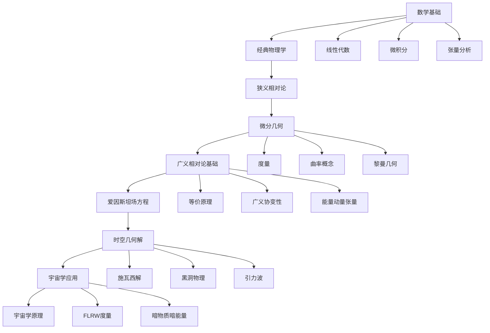
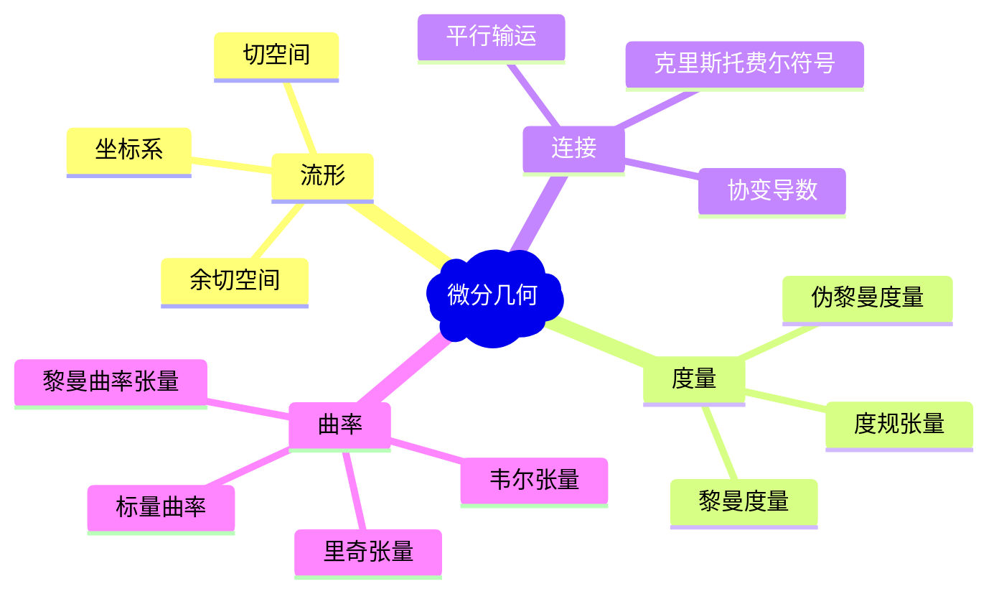
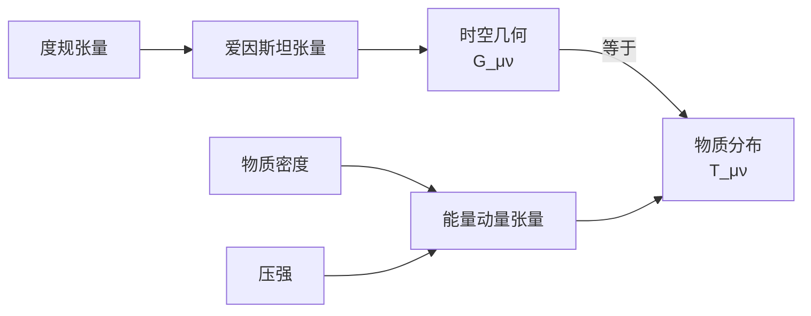

# 广义相对论与宇宙学学习全景视图

## 🎯 学习目标概览

本指南将带您从基础数学概念逐步深入到广义相对论的核心理论，最终理解现代宇宙学的基本原理。

## 📚 学习路径架构



## 🏗️ 知识体系结构

### 第一阶段：数学预备知识 (3-4个月)

#### 📐 基础数学工具
- **线性代数**
  - 向量空间和线性变换
  - 特征值和特征向量
  - 矩阵对角化

- **高等微积分**
  - 多元函数微积分
  - 向量分析
  - 偏微分方程基础

- **[张量分析](general_physics/2023-11-16-张量分析.md)**
  - 张量的定义和性质
  - 张量运算规则
  - 坐标变换

### 第二阶段：物理基础 (2-3个月)

#### ⚡ 经典力学与电磁学
- 拉格朗日力学
- 哈密顿力学
- 麦克斯韦方程组
- 洛伦兹变换

#### 🌟 狭义相对论
- 洛伦兹变换的物理意义
- 时空的统一
- 四维时空
- 能量动量关系

### 第三阶段：微分几何 (4-5个月)



#### 📏 度量结构
- **[度量概念](differential_geometry/2023-11-16-度量.md)**
  - 距离的数学描述
  - 黎曼度量 vs 伪黎曼度量
  - 度规张量的性质

#### 🌀 曲率理论
- **[黎曼曲率](differential_geometry/2023-11-16-黎曼曲率.md)**
  - 内蕴曲率与外在曲率
  - 曲率张量的几何意义
- **[里奇张量](differential_geometry/2023-11-16-里奇张量.md)**
  - 爱因斯坦张量的构造
  - 曲率的物理解释

### 第四阶段：广义相对论核心 (6-8个月)

#### 🎯 基本原理
- **[等价原理](general_relativity/2023-11-16-等价原理.md)**
  - 惯性质量与引力质量等价
  - 局部惯性系
  - 自由落体的几何化

- **[广义协变性](general_relativity/2023-11-16-广义协变性.md)**
  - 坐标系无关性
  - 张量方程的不变性

#### ⚖️ 物质源项
- **[能量动量张量](general_physics/2023-11-16-能量动量张量.md)**
  - 物质能量分布
  - 守恒定律
  - 完美流体模型

#### 🧮 核心方程
- **[爱因斯坦场方程](general_relativity/2023-11-16-爱因斯坦场方程.md)**

```latex
G_{\mu\nu} = \frac{8\pi G}{c^4} T_{\mu\nu}
```

几何 = 物质



### 第五阶段：经典解与应用 (4-6个月)

#### 🌑 球对称解
- **[施瓦西度量](general_relativity/2023-11-16-施瓦西度量.md)**
  - 静态球对称时空
  - 黑洞的数学描述
  - 事件视界

#### 📡 实验验证
- 水星近日点进动
- 光线偏折
- 引力红移
- 引力波探测

### 第六阶段：宇宙学应用 (3-4个月)

#### 🌌 宇宙学原理
- 均匀性与各向同性假设
- 宇宙学原理的数学表述
- FLRW度量

#### ⏰ 时间与演化
- **[宇宙学时间膨胀](astronomy/2023-11-16-宇宙学时间膨.md)**
  - 宇宙学红移
  - 时间膨胀效应
  - **汉弗莱斯度量**的创新理论

#### 🔮 现代宇宙学挑战
- **[暗物质](astronomy/2023-11-16-暗物质.md)**问题
- **[暗能量](astronomy/2023-11-16-暗能量.md)**与宇宙加速膨胀
- 宇宙常数问题

## 🛠️ 学习工具与方法

### 数学软件
- **Mathematica/Maple**: 符号计算
- **Python + SymPy**: 张量计算
- **GRTensorII**: 广义相对论专用软件

### 可视化工具
- **3D时空图**: 理解弯曲时空
- **光锥图**: 因果关系可视化
- **Penrose图**: 时空的共形表示

## 📖 推荐学习资源

### 教材层级
1. **入门级**: 
   - Schutz - "A First Course in General Relativity"
   - Hartle - "Gravity: An Introduction to Einstein's General Relativity"

2. **中级**: 
   - Carroll - "Spacetime and Geometry"
   - Wald - "General Relativity"

3. **高级**: 
   - Misner, Thorne & Wheeler - "Gravitation"
   - Hawking & Ellis - "The Large Scale Structure of Space-Time"

## 🎓 学习检查点

### 微分几何检查点
- [ ] 能够计算简单度规的克里斯托费尓符号
- [ ] 理解曲率张量的物理意义
- [ ] 掌握协变导数的计算

### 广义相对论检查点
- [ ] 推导施瓦西度量
- [ ] 计算测地线方程
- [ ] 理解爱因斯坦场方程的物理含义

### 宇宙学检查点
- [ ] 推导弗里德曼方程
- [ ] 理解宇宙学参数的物理意义
- [ ] 分析不同宇宙模型的演化

## 🌟 学习建议

### 学习策略
1. **渐进式学习**: 不要跳跃，每个概念都要扎实掌握
2. **动手计算**: 亲自推导重要公式，培养数学直觉
3. **物理直觉**: 始终保持对物理图像的理解
4. **连接实际**: 关注实验验证和天体物理应用

### 常见困难点
- **数学抽象性**: 张量概念的理解
- **几何直觉**: 高维弯曲时空的想象
- **物理解释**: 数学形式背后的物理意义

## 🚀 进阶方向

学完基础后，可以探索：
- **量子场论在弯曲时空中的应用**
- **弦理论与额外维度**
- **圈量子引力**
- **数值相对论**
- **引力波天体物理学**

---

> 💡 **学习金句**: "时空告诉物质如何运动，物质告诉时空如何弯曲。" —— 约翰·惠勒

记住，学习广义相对论是一个需要耐心和毅力的过程。每一个概念都建立在前面的基础之上，所以请确保每一步都理解透彻再继续前进。祝您学习愉快！ 